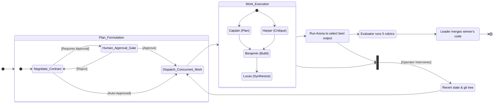

# Korg System Architecture & Internals

**Document Version:** 1.2
**Lead Auditor:** Principal Systems Programmer
**Classification:** Korg Internal Technical Reference (Unclassified)

This document provides a master-class technical reference for the internal architecture of the Korg Autonomous Engineering Runtime. It details the core principles of security, concurrency, and cryptographic-grade provenance that underpin the system.

---

## 1. Core Philosophy: Zero-Trust Execution & Absolute Memory Safety

Korg is engineered from the ground up on the principle of **Zero-Trust**. No component, whether an AI agent or a system module, is implicitly trusted. Every action is verified, sandboxed, and recorded. This is achieved through a combination of the Rust programming language's intrinsic safety guarantees and a purpose-built distributed systems architecture.

### 1.1. Rust Backend: Guarantees of Safety and Isolation

The entire Korg backend is implemented in Rust, which provides foundational guarantees against common security vulnerabilities at compile time.

*   **Absolute Memory Safety:** Rust's ownership and borrowing model eliminates entire classes of memory errors.
    *   **No Null Pointer Dereferences:** The `Option<T>` and `Result<T, E>` enums force explicit handling of potentially absent values, making null pointer exceptions impossible.
    *   **No Buffer Overflows:** All memory access is bounds-checked by default. Any attempt to access an array or vector out of bounds results in a controlled panic, not a silent memory corruption that could be exploited.
    *   **No Data Races:** The `Send` and `Sync` traits, enforced by the compiler, guarantee that data shared between threads (or `async` tasks) cannot be accessed in a way that causes race conditions. All shared state is protected by concurrency primitives like `Arc<Mutex<T>>`, ensuring exclusive access.

*   **Isolated Execution via OS Processes:** Korg does not run AI agents as threads within a single process. Instead, as detailed in `src/leader.rs`, each of the four swarm personas is spawned as a **separate operating system child process**.
    *   **Process Sandboxing:** Each agent runs in its own memory space, completely isolated from the Leader Orchestrator and other agents. A crash or exploit in one agent (e.g., the `Benjamin` builder persona) cannot affect the memory of the parent or its siblings.
    *   **Strictly-Typed Communication:** Communication between the Leader and workers occurs exclusively over `stdin`/`stdout` using the **Autonomous Communication Protocol (ACP)**. All messages are serialized JSON, strictly validated against `AcpMessage` structs. This prevents injection attacks or malformed data from corrupting the state of the receiver.
    *   **Filesystem Sandboxing with `git worktree`:** As shown in the `run_self_healing_loop` and `handle_operator_fork` functions in `src/leader.rs`, Korg uses `git worktree` to create transient, isolated filesystem sandboxes for each campaign or speculative execution. Agents perform all file modifications within these worktrees. If a build fails or a policy is violated, the entire worktree can be discarded without affecting the main repository branch, ensuring the primary codebase remains pristine.

---

## 2. The CRDT Blackboard: A Decoupled Transactional State Machine

Korg's concurrency model is not based on direct agent-to-agent messaging. Instead, it uses a **Blackboard Architecture**, inspired by gravitational wells, where agents orbit a shared state. This blackboard, defined conceptually in `src/blackboard.rs`, is implemented as a set of **Conflict-free Replicated Data Types (CRDTs)** to ensure eventual consistency and high concurrency without complex locking.

### 2.1. Architecture (`src/blackboard.rs`)

The blackboard is not a simple shared memory buffer. It is a transactional, log-structured system where agents propose state changes rather than directly mutating state.

*   **Decoupled State:** The `Blackboard` is managed by the `LeaderOrchestrator` within an `Arc<Mutex<Blackboard>>`. However, workers do not get direct access. They interact with it by emitting `AcpMessage::SwarmTelemetryPulse` messages. The Leader is the sole authority that ingests these pulses and merges them into the central blackboard state. This decouples agents from the state's implementation and enforces the Leader's role as the reconciler.

*   **Transactional CRDT Log:** The core of the blackboard is a log of `TraceEvent` structs. This is modeled as a **Grow-Only Set (G-Set)** CRDT.
    *   Each agent can concurrently add new `TraceEvent`s to its local replica of the log.
    *   The Leader periodically merges these logs. Since agents can only add events, merges are trivial and conflict-free.
    *   This provides a complete, immutable history of all significant agent actions and observations.

*   **Key-Value State with LWW-Registers:** For mutable state (e.g., current file content, test results), the blackboard uses **Last-Writer-Wins (LWW) Registers**.
    *   When an agent proposes a change to a file, it submits a mutation with a timestamp.
    *   During reconciliation, the Leader accepts the mutation with the latest timestamp, resolving conflicts deterministically.
    *   This allows agents to work on the same files concurrently, with the "freshest" work prevailing, subject to later evaluation in the Arena.

This CRDT-based approach allows the swarm to operate at high concurrency with minimal contention, as agents write to a local log and the expensive reconciliation is handled asynchronously by the Leader.

---

## 3. The 4-Persona Adversarial Swarm Topology

Korg's cognitive engine is a swarm of four specialized AI personas. They collaborate in an adversarial but productive topology, ensuring that generated code is not just functional but also robust, secure, and aligned with the overall goal. This model is orchestrated by the `LeaderOrchestrator` in `src/leader.rs`.

1.  **Captain (Orchestrator): The Planner & Negotiator**
    *   **Role:** Decomposes the high-level `root_task` into a structured plan of `work_packages`.
    *   **Function:** Leads the `negotiate_contract` phase, proposing acceptance criteria and debating them with the Evaluator (Harper) to form a binding `Contract` artifact. This ensures work begins with a clear, verifiable definition of "done."
    *   **Source:** `leader.rs::decompose_into_persona_packages()`, `leader.rs::negotiate_contract()`.

2.  **Harper (Auditor): The Harsh Critic & Security Guardrail**
    *   **Role:** Acts as the adversarial guardrail. It does not write production code but critiques the work of others.
    *   **Function:** Implements the five harsh binary rubrics (Trajectory, Epistemic, Tool-Use, Semantic, Resource) defined in `src/evaluator.rs`. It consumes `TraceEvent`s from the blackboard and produces an `EvaluationVerdict` that directly influences the Leader's decision to scale, revise, or terminate the swarm. It is the core of the system's self-regulation loop.
    *   **Source:** `src/evaluator.rs`.

3.  **Benjamin (Builder): The Prolific but Unreliable Coder**
    *   **Role:** The primary code generator. Benjamin is optimized for speed and creativity, translating plans and research into concrete code mutations.
    *   **Function:** Produces the bulk of the code changes (`PersonaResult` containing mutations). It is intentionally designed to be fallible; `leader.rs` shows it can "crash" (fail compilation), triggering the `run_self_healing_loop` where its own compiler errors are fed back to it for repair.
    *   **Source:** `leader.rs::run_self_healing_loop()`.

4.  **Lucas (Synthesizer): The Reconciler & Finisher**
    *   **Role:** The final integration and quality assurance stage. Lucas takes the outputs from all other personas and synthesizes them into a single, cohesive, and correct final patch.
    *   **Function:** Runs the `perform_semantic_merge` logic, which uses an LLM to reconcile competing mutations from different personas. It also runs final verification tests to ensure the merged output is stable and correct.
    *   **Source:** `leader.rs::perform_semantic_merge()`.

### 3.1. State Transition & Collaboration Flow

The interaction between these personas follows a well-defined, observable sequence orchestrated by the Leader.

---

## 4. The Cryptographic Provenance Chain (`src/provenance.rs`)

Every significant action in Korg is recorded in a **tamper-proof cryptographic ledger**, forming a Merkle-DAG of campaign history. This provides an unbreakable audit trail and enables powerful features like timeline scrubbing.

### 4.1. The `.ktrans` Artifact

The fundamental block of the ledger is the **CampaignKtrans** artifact. As seen in `leader.rs::persist_campaign_ktrans`, a `.ktrans` file is a signed JSON object created at the end of each major campaign round. It contains:
*   **`tx_hash`**: A unique, content-addressed hash of the transaction's payload.
*   **`parent_hashes`**: An array of `tx_hash` values from the preceding transactions, forming the links in the Merkle-DAG.
*   **`state_merkle_root`**: A SHA-256 hash of the entire logical blackboard state at the time of the transaction.
*   **`codebase_merkle_root`**: The `git write-tree` hash of the physical workspace, capturing the exact state of all tracked files.
*   **`signature`**: An **Ed25519** signature of the `tx_hash`, created using the per-campaign `campaign_signing_key`. This provides non-repudiation, proving the transaction was authorized by the Leader.

### 4.2. JCS Canonicalization (RFC 8785)

To ensure that the `tx_hash` is deterministic and verifiable, the `CampaignKtrans` payload is canonicalized before hashing. As specified in `src/provenance.rs::compute_sha256` and the `canonical_json` dependency, Korg uses **JSON Canonicalization Scheme (JCS)**. This involves:
1.  Sorting all object keys lexicographically.
2.  Removing insignificant whitespace.
3.  Using a standardized representation for numbers and strings.

This guarantees that two systems will produce the exact same byte stream for a given transaction payload, resulting in an identical SHA-256 hash.

### 4.3. Playhead Timeline Scrubbing & Steering Forks

The provenance chain is not just for auditing; it's an interactive state-management tool. The `leader.rs::handle_operator_fork` function implements "Playhead Steering Forks."

When an operator initiates a fork from a specific transaction `tx_N`:
1.  **Logical State Rehydration:** The Leader retrieves the `state_merkle_root` from `tx_N`'s `.ktrans` file. It then finds the corresponding state blob (e.g., `/tmp/korg/campaigns/{id}/state-blobs/{hash}.json`) and overwrites the active blackboard with this historical state.
2.  **Physical State Reversion:** The Leader uses the `codebase_merkle_root` (a git tree hash) from `tx_N` and executes `git read-tree --reset -u <hash>` to instantly revert the entire file workspace to its exact state at that point in time.

This powerful mechanism allows an operator to rewind a "hallucinating" or errant swarm to a known-good state and provide a new directive, effectively forking the entire execution timeline.

---

## 5. Visual Firewall: OCR Pixel Redaction & Fail-Secure Loops (`src/vision_policy.rs`)

Korg's agents often interact with GUIs, web pages, and other visual interfaces. To prevent the accidental leakage of sensitive information (e.g., API keys, passwords, PII) in screenshots, Korg implements a **fail-secure visual firewall**.

### 5.1. The `check_attachment` Intercept Loop

Every `VisionAttachment` (screenshot) captured by an agent is passed through the `vision_policy::check_attachment` function before it can be broadcast or saved. This function performs a multi-layered security scan:

1.  **Metadata Scan:** It first checks the attachment's `name` and `description` against a configurable list of `block_patterns` (e.g., "password", "secret", "api_key").

2.  **Simulated OCR Scan:** The `data_base64` payload is decoded into raw bytes. The policy engine then performs a case-insensitive string search for the same `block_patterns` within this byte stream. This simulates an Optical Character Recognition (OCR) process, catching sensitive data that might be rendered visually in the image.

3.  **Temporal Analysis:** The policy engine maintains a history of recent visual frames (`VISUAL_HISTORY`). This enables it to detect advanced threats:
    *   **Split-Credential Leaks:** It checks if a secret is being leaked across two consecutive frames (e.g., `sk-proj-` in frame N, and `12345...` in frame N+1).
    *   **Transient Leaks:** It detects if a secret appears in one frame but is gone in the next (e.g., a briefly visible pop-up). If a leak is detected in frame N that is absent in N+1, the engine will *retrospectively redact* frame N in the `VISUAL_HISTORY`, ensuring the leak is neutralized even after the fact.

### 5.2. Fail-Secure Redaction

If any scan detects a policy violation, the firewall immediately triggers a fail-secure response:

*   The `verdict` field of the `VisionAttachment` is set to `REDACTED` or `BLOCKED`.
*   The original, sensitive `data_base64` is moved to a `raw_data_base64` field, which is never broadcast.
*   The public `data_base64` field is **overwritten** with a safe placeholder, such as the 1x1 pixel `BLACKOUT_PNG_BASE64` constant.

This ensures that even if other parts of the system malfunction, the raw screenshot data never escapes the security boundary. The `web.rs` module respects this, explicitly checking the verdict and using the placeholder for redacted images before sending them to the browser via SSE, guaranteeing that no sensitive visual information ever reaches an operator's screen unless explicitly overridden.