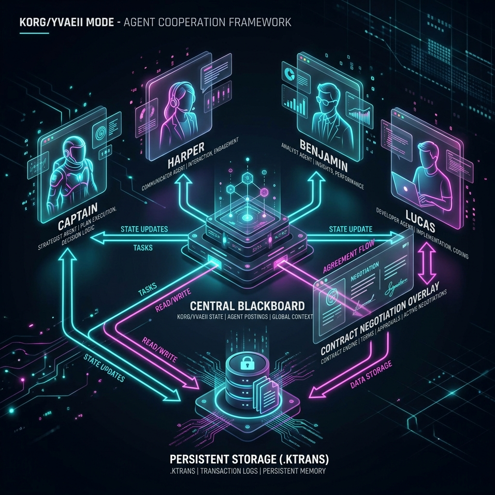
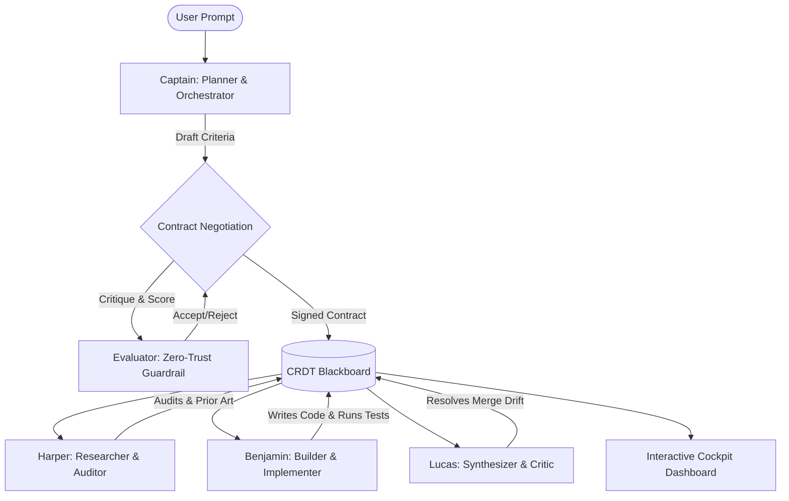

# Korg System Architecture

This document describes the system architecture of **Korg / Yvaeh Mode**, an advanced, adversarial multi-agent orchestration runtime designed for autonomous software engineering. 

Korg represents a paradigm shift from traditional passive agent tools: it is an **Autonomous Software Engineering Environment (ASEE)** built as an active runtime with an integrated cockpit, where humans and agent swarms execute and synchronize state in the same unified timeline.

---

## 🏛️ Architecture Overview

The Korg runtime is centered around a decoupled, thread-safe transactional blackboard that acts as the single source of truth (SSOT) for all agent activities. Agents do not communicate directly; instead, they publish events and read state through standard transactions, producing a cryptographically signed transaction log (`.ktrans`).

### Core Architectural Layers

1. **Orchestration Kernel (`src/leader.rs`)**
   * Manages the lifecycle of agent campaigns and worker processes.
   * Coordinates the multi-round **Contract Negotiation** loop.
   * Intercepts tool executions and checks them against declarative policies.
   * Orchestrates crash detection, state rehydration, and time-travel forks.

2. **Decoupled CRDT Blackboard (`src/blackboard.rs`)**
   * Acts as a shared, thread-safe memory space for the swarm.
   * Provides optimistic local-first updates and state pulse ingestion.
   * Logs all state mutations as structured `TraceEvent` objects.

3. **Cognitive LLM Provider Core (`src/llm.rs`)**
   * Unified, zero-dependency model-agnostic abstraction.
   * Standardizes completions and server-sent event (SSE) streams across OpenAI, Anthropic (Claude), xAI (Grok), and Local Ollama.
   * Includes circuit breakers and exponential backoff retry wrappers (`ResilientLlmProvider`) for high-availability production workloads.

4. **Heavy Adversarial Evaluator (`src/evaluator.rs`)**
   * A standalone zero-trust critic that intercepts proposed actions.
   * Uses a local **Candle BERT model (`all-MiniLM-L6-v2`)** to compute real-time semantic cosine similarity.
   * Scores operations across 5 binary grading dimensions (Syntactic, Operational, Security, Verification, Alignment).

5. **Integrated Cockpit UI (`src/tui.rs`)**
   * A vibrant, 24-bit TrueColor Terminal User Interface (TUI) built on Ratatui.
   * Displays concurrent agent write-locks, active terminals, swarm metrics, and a branching DAG.
   * Enables time-travel playhead scrubbing and key-bound (`F`) branching.

---

## 🔄 Swarm Collaboration Topology

Korg spawns a highly coordinated 4-persona swarm (expandable up to 16 members under high-concurrency demand) that operates through an adversarial check-and-balance topology.

### The 4 Persona Strategies

*   **Captain (Swarm Orchestrator)**: Decomposes objectives into detailed step-by-step DAG plans. Monitors execution progression and scales swarm size dynamically based on conflict rates and throughput.
*   **Harper (Codebase Auditor)**: Audits the repository for security vulnerabilities, compliance breaches, and structural design pattern alignment prior to any modifications.
*   **Benjamin (Builder & Implementer)**: Executes writes, applies fuzzy unified patches (`src/tools.rs`), compiles code, and triggers testing harnesses.
*   **Lucas (Swarm Critic & Synthesizer)**: Analyzes concurrent edits across parallel workspaces, identifies drift, resolves code merge conflicts, and maintains codebase integrity.

---

## 🔒 Adversarial Contract Negotiation

Before a campaign begins, the **Captain** must negotiate an explicit contract with the **Evaluator**. This process ensures that the swarm has clear, quantifiable objectives.

1. **Proposal**: The Captain generates a list of strict success criteria.
2. **Evaluation**: The Evaluator embeds the criteria using BERT and calculates semantic similarity against the user prompt.
3. **Acceptance Threshold**: The proposal is accepted only if:
   $$\text{Average Cosine Similarity} \ge 0.42 \quad \text{AND} \quad \text{Criteria Count} \ge 3$$
4. **Rejection Loop**: If the proposal fails, the Evaluator rejects it with actionable feedback. This cycle repeats for up to 3 rounds.
5. **Signing**: Once accepted, the contract is signed and written to `/tmp/korg/contracts/<task_id>.contract.json`.

---

## 🛡️ Transactional Memory & Crash Recovery

Every action performed by a worker process produces a cryptographically signed **`.ktrans`** transaction package containing:
*   An Ed25519 signature of the event payload.
*   The parent transaction Merkle hash.
*   A diff of affected files and Blackboard state mutations.

### Resiliency and Healing Loop
If a worker process crashes mid-execution (simulated or real):
1. The **Orchestration Kernel** catches the non-zero exit code.
2. The campaign is temporarily stalled to prevent state pollution.
3. The kernel scans the `/tmp/korg/ktrans` directory for partial transaction signatures.
4. Valid intermediate transactions are merged back into the central Blackboard.
5. A fresh, clean worker instance is re-spawned with the exact rehydrated state, continuing execution seamlessly without data loss.

---

## ⏳ Replay Scrubber and Steering Forks

The signature interaction loop of Korg is its **time-travel playhead scrubbing**:

*   **Scrubbing**: The operator uses the `Left` and `Right` arrow keys to move the playhead across the transaction timeline. Moving backward triggers `RouteWork::Replay` commands that reconstruct the historical Blackboard state.
*   **Steering Fork (`F` Key)**: At any historical point, the operator can press the **`F`** key. This opens a modal to type a new **Swarm Steering Directive**. Korg then:
    1. Reverts the Blackboard state up to the chosen transaction.
    2. Writes a fresh snapshot to `/tmp/korg/blackboard/blackboard.json`.
    3. Clones all workspace files to a sandboxed `/tmp/korg/forks/tx_<tx_id>/` directory.
    4. Launches a fresh parallel swarm execution branch from that exact point in time.

---

*This document serves as Korg's technical architecture reference for researchers, core maintainers, and security auditors.*
