# Korg System Architecture & Internals

This document provides a master-class technical reference for the internal architecture of the Korg Autonomous Engineering Runtime. It is intended for security auditors, systems programmers, and core contributors.

## 1. Core Philosophy: Zero-Trust, Isolated Execution

Korg is engineered from the ground up on the principle of **Zero-Trust**. No component, whether an AI persona or a system utility, is implicitly trusted. Every action is sandboxed, every state transition is cryptographically signed, and all data flows through strict policy-enforcement gateways. This is achieved through a combination of Rust's language-level guarantees and a carefully designed process and filesystem isolation model.

### 1.1. Absolute Memory Safety via Rust

The entire Korg backend is implemented in Rust, which provides compile-time guarantees of memory safety without the overhead of a garbage collector. This is fundamental to Korg's security posture.

-   **Ownership and Borrowing**: Rust's ownership model ensures that there is always one and only one "owner" of any given piece of memory. Data can be immutably borrowed by multiple parties or mutably borrowed by exactly one party. This statically prevents data races at compile time. In Korg, shared state like the `Blackboard` is wrapped in concurrency primitives like `Arc<Mutex<T>>`, which enforce these borrowing rules at runtime, ensuring that even in a highly concurrent multi-agent system, there are no data races.
-   **Absence of Null and Undefined Behavior**: Rust's type system eliminates null pointer dereferences through the `Option<T>` and `Result<T, E>` enums. This forces developers to handle the absence of a value explicitly, preventing entire classes of bugs and security vulnerabilities common in other systems languages.
-   **Fearless Concurrency**: The combination of ownership rules and type-system constraints allows Korg to manage the 4-Persona Swarm with "fearless concurrency." The compiler guarantees that any data shared between threads (i.e., between the Leader orchestrator and its various tasks) is done so safely.

### 1.2. Isolated Execution via Process Sandboxing

Memory safety alone is insufficient for securing an autonomous agent that can execute arbitrary code. Korg enforces strict process and filesystem isolation for all persona operations.

-   **Child Process Workers**: As detailed in `src/leader.rs`, each AI persona (Captain, Harper, Benjamin, Lucas) is spawned as a separate OS-level child process (`tokio::process::Command`). They run as a `korg worker` subcommand. This provides kernel-level memory isolation. A crash or exploit in one persona's process cannot directly access the memory of the Leader or other personas.
-   **`git worktree` Sandboxes**: Before a persona like `Builder Benjamin` begins code synthesis, the `LeaderOrchestrator` creates a transient, isolated filesystem sandbox using `git worktree`. This command creates a linked copy of the repository in a temporary directory (e.g., `/tmp/korg/worktrees/...`).
    -   All file modifications, compilations (`cargo check`), and tests are executed *exclusively* within this sandbox.
    -   The main repository branch remains pristine and untouched.
    -   If the generated code fails to compile, fails tests, or is rejected by the `Evaluator`, the entire worktree directory is simply discarded. This is a powerful, stateless, and fail-secure mechanism for experimentation.
-   **Zero-Trust ACP Protocol**: Communication between the Leader and worker processes occurs over `stdio` using the Autonomous Control Protocol (ACP). Every message is wrapped in a signed `MessageEnvelope`. This ensures that even if a worker process were compromised, it could not spoof messages as another worker or the Leader without access to the campaign's private signing key.

## 2. The Transactional CRDT Blackboard (`src/blackboard.rs`)

At the heart of Korg's concurrency model is the **Blackboard**, a central, observable state repository. It is modeled not as a simple key-value store, but as a transactional, conflict-free data structure inspired by CRDTs (Conflict-free Replicated Data Types).

-   **Architecture**: The primary blackboard is implemented as `Arc<Mutex<Blackboard>>`, making it a thread-safe handle that can be shared among the Leader's asynchronous tasks. While the provided source shows a `Mutex`, the underlying design pattern is CRDT-like. Personas do not perform arbitrary reads/writes; instead, they submit **transactions** (`SubmitTransaction` ACP message) which represent proposed state changes.
-   **Transactional State Changes**: The `LeaderOrchestrator` is the sole entity that "compacts" or applies these transactions to the canonical state. It receives `SubmitTransaction` messages from the personas, evaluates them in the **Arena**, and then merges the winning state change. This serialized application of transactions by a single trusted authority (the Leader) prevents the race conditions and deadlocks typical of shared-memory concurrency while allowing personas to work in parallel.
-   **CRDT-like Merging**: The `perform_semantic_merge` function in `src/leader.rs` exemplifies this principle. It takes the outputs from all competing personas and uses a "Synthesizer" persona (Lucas) to reconcile them into a single, cohesive set of mutations. This is analogous to a CRDT merge function that resolves concurrent updates into a deterministic, final state.
-   **Observability**: The Blackboard is the "Gravitational Well" around which the swarm orbits. It is the single source of truth for system telemetry. Personas emit `SwarmTelemetryPulse` messages, which the Leader ingests into the Blackboard's `trace_buffer`. The `Evaluator` then reads this buffer to assess the swarm's health, creating a tight, observable feedback loop. The state is exposed via the `/api/state` endpoint for the web cockpit, providing real-time observability to the human operator.

## 3. 4-Persona Adversarial Swarm Topology

Korg employs a fixed 4-persona swarm, where each agent has a specialized, adversarial role. This division of labor creates a system of checks and balances that promotes robust, high-quality output.

1.  **Orchestrator Captain (The Planner)**:
    -   **Role**: High-level strategist and planner.
    -   **Function**: Receives the initial root task from the operator. Decomposes the task into smaller, actionable work packages (`decompose_into_persona_packages` in `src/leader.rs`). Initiates the `ContractNegotiation` phase, proposing acceptance criteria for the task. The Captain sets the direction for the entire swarm.

2.  **Auditor Harper (The Researcher/Critic)**:
    -   **Role**: Context-gatherer, researcher, and adversarial critic.
    -   **Function**: During `ContractNegotiation`, Harper (acting as part of the `Evaluator`) critiques the Captain's proposed criteria for ambiguity and relevance, forcing a more robust contract. During execution, Harper is assigned "Research" tasks, gathering information from the codebase or external sources to inform the Builder. Harper's primary function is to prevent the swarm from "hallucinating" or working with incorrect assumptions.

3.  **Builder Benjamin (The Coder)**:
    -   **Role**: Primary code generator and implementer.
    -   **Function**: Receives a specific work package and the negotiated `Contract`. Benjamin's role is to write the code to fulfill the contract. This persona is responsible for generating the `mutations` (code changes) within its isolated `git worktree` sandbox. As seen in `run_self_healing_loop`, Benjamin's output is subject to the most scrutiny, including automated compilation checks and repair loops.

4.  **Synthesizer Lucas (The Reconciler)**:
    -   **Role**: Merger and finalizer.
    -   **Function**: After all personas have submitted their work, the `LeaderOrchestrator` invokes Lucas. As shown in `perform_semantic_merge`, Lucas's job is to take the winning proposal from the **Arena** and intelligently merge it with complementary ideas from the other personas. This produces a final, cohesive patch that is more robust than any single persona's output.

This adversarial collaboration ensures that a plan is critiqued before it's executed, code is generated based on a solid plan, and multiple proposed solutions are synthesized into a superior final product.

## 4. State Transition Sequence

The Korg campaign loop follows a deterministic state transition sequence, managed by the `LeaderOrchestrator`. This ensures a predictable and auditable flow of execution.

```mermaid
stateDiagram-v2
    direction LR
    [*] --> PlanDecomposition: Operator initiates campaign

    state PlanDecomposition {
        direction LR
        [*] --> Captain: Decompose Task
    }
    PlanDecomposition --> ContractNegotiation: Plan Formulated

    state ContractNegotiation {
        direction LR
        [*] --> ProposeCriteria: Captain
        ProposeCriteria --> Critique: Evaluator (Harper)
        Critique --> ProposeCriteria: Revise
        Critique --> [*]: Contract Signed
    }
    ContractNegotiation --> DispatchWork: Contract Approved

    state DispatchWork {
        direction LR
        [*] --> SpawnWorkers: Leader
        SpawnWorkers --> WorkspaceSynthesis: Workers Active
    }

    state WorkspaceSynthesis <<fork>>
        DispatchWork --> WorkspaceSynthesis
        state "Benjamin (Build)" as Benjamin
        state "Harper (Research)" as Harper
        state "Lucas (Synthesize)" as Lucas
        WorkspaceSynthesis --> Benjamin
        WorkspaceSynthesis --> Harper
        WorkspaceSynthesis --> Lucas

    Benjamin --> SubmitTransaction
    Harper --> SubmitTransaction
    Lucas --> SubmitTransaction

    SubmitTransaction --> ArenaEvaluation: All workers complete

    state ArenaEvaluation {
        direction LR
        [*] --> ScoreCandidates: Leader
        ScoreCandidates --> SelectWinner: Highest Confidence
        SelectWinner --> [*]
    }
    ArenaEvaluation --> VerdictHandling: Winner Selected

    state VerdictHandling {
        direction LR
        [*] --> IngestTelemetry: Leader
        IngestTelemetry --> EvaluateRubrics: Evaluator
        EvaluateRubrics --> RecommendAction: Verdict
        RecommendAction --> [*]
    }
    VerdictHandling --> StateCompaction: Action Determined

    state StateCompaction {
        direction LR
        [*] --> MergeWinner: Leader
        MergeWinner --> PersistKtrans: Sign Transaction
        PersistKtrans --> [*]
    }
    StateCompaction --> CampaignComplete: Final Round
    StateCompaction --> DispatchWork: Loop (Revise/Continue)

    CampaignComplete --> [*]
```

## 5. Cryptographic Provenance Chain (`src/provenance.rs`)

Korg maintains a tamper-proof audit trail of every significant action using a cryptographic provenance chain, stored as `.ktrans` (Korg Transaction) artifacts. This system provides non-repudiation for the AI's reasoning process.

-   **Parent-Hash Linking & Merkle-DAG**: Each `.ktrans` artifact, represented by the `CampaignKtrans` struct, contains a `parent_hashes` field. This field stores the `tx_hash` of the preceding transaction(s). This explicit linking forms a Merkle Directed Acyclic Graph (DAG), identical in principle to a blockchain. Any modification to a past transaction would invalidate its hash, breaking the entire chain and making tampering immediately detectable. The `replay_campaign` function in `leader.rs` validates this chain integrity.

-   **JCS Canonicalization (RFC 8785)**: The `tx_hash` of a transaction is not a hash of a simple string. It is a SHA-256 hash of the **canonicalized** JSON representation of the transaction payload. Korg uses a JSON Canonicalization Scheme (JCS) compatible implementation (`canonical_json` crate). This process involves sorting keys, removing insignificant whitespace, and standardizing number/string formats. This ensures that two logically identical transactions will *always* produce the same hash, regardless of how they are formatted in memory. This is critical for deterministic, verifiable distributed systems. The `compute_sha256` function in `src/provenance.rs` is the heart of this mechanism.

-   **Playhead Timeline Scrubbing & Steering Forks**: The provenance chain is not just a passive audit log; it is an interactive time machine. The `CampaignKtrans` struct cryptographically links the logical state (`state_merkle_root`) with the physical codebase state (`codebase_merkle_root`, a git tree hash).
    -   When an operator initiates a "Playhead Steering Fork" (as described in `DOCS.md` and handled in `leader.rs`), Korg uses the selected transaction's `codebase_merkle_root` to physically reset the workspace using `git read-tree --reset -u <tree-hash>`.
    -   Simultaneously, it uses the `state_merkle_root` to find the corresponding state blob and rehydrate the logical `Blackboard`.
    -   This powerful feature allows an operator to rewind the AI's "thought process" and codebase to any valid, signed point in history and "fork" its execution in a new direction, all with cryptographic guarantees of integrity.

## 6. OCR Pixel Redaction & Visual Firewall (`src/vision_policy.rs`)

Since Korg personas can interact with GUIs and web browsers, a critical security vector is the accidental exposure of sensitive data in screenshots. The Visual Policy Engine in `src/vision_policy.rs` acts as a fail-secure firewall for all visual data.

-   **Fail-Secure Intercept Loop**: The `check_attachment` function is the core of the visual firewall. It intercepts every `VisionAttachment` before it is added to the `Blackboard` or broadcast to the UI. It operates on a default-deny principle: if any configured `block_patterns` (e.g., "password", "api_key", "secret") are found, the attachment is immediately flagged for redaction or blocking.

-   **Multi-Layer Pattern Matching**: The engine doesn't just scan filenames. It performs a deep inspection:
    1.  **Metadata Scan**: Checks the attachment's `name` and `description`.
    2.  **OCR Scan**: Decodes the `data_base64` payload and performs a case-insensitive string search on the raw byte content. This effectively scans the content of text-based images (like SVGs) or the output of a real OCR engine.
    3.  **High-Entropy String Detection**: The `get_high_entropy_words` function calculates the Shannon entropy of words in the OCR text. This allows it to detect randomized, password-like strings (e.g., API keys, tokens) even if they don't match a specific keyword pattern.

-   **Temporal Analysis for Transient & Split Leaks**: The most advanced feature is its temporal analysis, which uses a `VISUAL_HISTORY` buffer to compare the current frame (N) with the previous one (N-1).
    -   **Transient Leak**: If a secret appears in frame N-1 but disappears in frame N, the engine retrospectively redacts frame N-1. This catches secrets that are only visible for a fraction of a second.
    -   **Split-Credential Leak**: The engine concatenates the text from frames N-1 and N to check if a secret was split across two consecutive screenshots to evade detection.

-   **Pixel Redaction**: Upon detecting an infraction, the engine does not simply discard the image. It replaces the `data_base64` payload with a constant, opaque placeholder (e.g., `BLACKOUT_PNG_BASE64`, a 1x1 black pixel). This maintains the integrity of the event stream (an attachment was still captured) while ensuring no sensitive data is persisted or broadcast. This redaction is enforced again at the web-server level in `src/web.rs` before being sent over SSE, providing a second layer of defense.