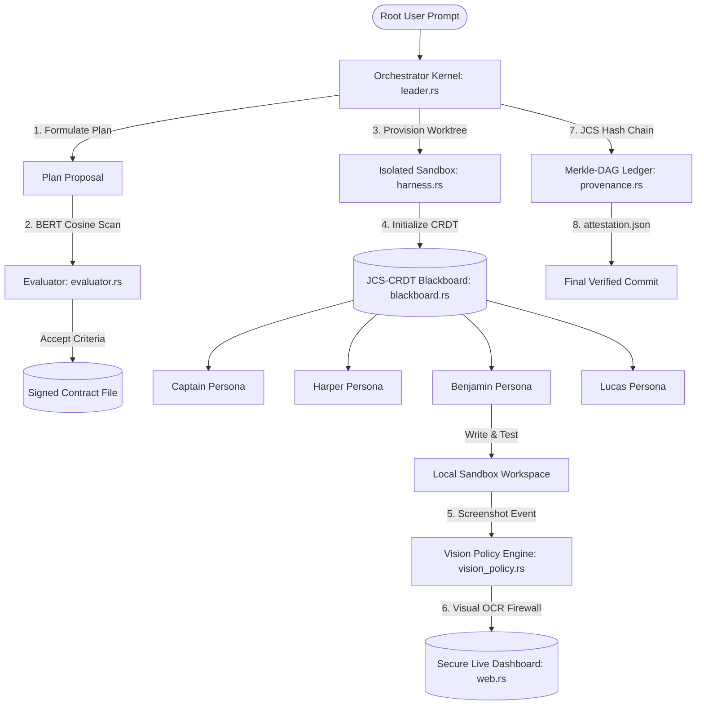

# korg — Autonomous Software Engineering Runtime

[](LICENSE)
[](file:///Users/clubpenguin/Documents/Korg/walkthrough.md)
[](https://yvaehkorg.lol)

Korg is a **cryptographically verifiable, high-assurance Autonomous Software Engineering Runtime (ASER)** engineered for high-consequence development. Rather than acting as a passive CLI helper or boilerplate script generator, Korg functions as an active, isolated sandbox environment that treats software synthesis as a state-synchronized, mathematically verifiable transaction ledger.

By unifying **multi-persona adversarial consensus**, **content-addressed Merkle-DAG campaign records**, **transient Git worktree sandboxing**, and an **inline multi-modal Vision Policy Engine (visual firewall)**, Korg provides enterprise-grade safety and absolute auditability for autonomous code modifications.

---

## 🔬 Core Theoretical Pillars & Formal Specifications

Korg operates on a series of mathematical and logical guardrails designed to prevent state pollution, eliminate secret leakage, and guarantee deterministic reproducibility.

### 1. Adversarial Contract Negotiation
Before any code modification campaign begins, the orchestrator (**Captain**) must negotiate a concrete, quantifiable contract with the critics (**Evaluator**). The Evaluator computes the semantic similarity of proposed success criteria against the user's root prompt using local BERT embeddings ($\text{all-MiniLM-L6-v2}$).

The proposal is signed and committed to the ledger only if the average cosine similarity satisfies the following threshold:

$$\text{Average Cosine Similarity} = \frac{1}{|C|} \sum_{c \in C} \frac{\vec{c} \cdot \vec{p}}{\|\vec{c}\| \|\vec{p}\|} \ge 0.42 \quad \land \quad |C| \ge 3$$

Where:
* $C$ is the set of proposed contract criteria.
* $\vec{c}$ is the high-dimensional BERT embedding of a single criterion.
* $\vec{p}$ is the high-dimensional BERT embedding of the user's root prompt.
* If this threshold is not met, the campaign is aborted to prevent off-target drift.

### 2. Cryptographic Merkle-DAG State-Sync
Every campaign execution tick, workspace mutation, and operator steering override is treated as a cryptographically signed transaction $\mathcal{T}_i$. State is synchronized globally across the swarm using content-addressed blobs.

State transition hashes are linked sequentially inside a cryptographically secure Merkle-DAG:

$$\mathcal{T}_i = \text{Sign}_{\text{Auth}}\left( \text{JCS}\left( \text{Payload}_i \mathbin{\Vert} H(\mathcal{T}_{i-1}) \mathbin{\Vert} \mathcal{M}_{code} \mathbin{\Vert} \mathcal{M}_{state} \right) \right)$$

Where:
* $\text{JCS}$ represents JCS Canonicalization (RFC 8785) guaranteeing deterministic JSON encoding across platforms.
* $H(\mathcal{T}_{i-1})$ is the cryptographic SHA-256 hash of the parent transaction envelope.
* $\mathcal{M}_{code}$ is the codebase Merkle root returned by the physical git index (`git write-tree`).
* $\mathcal{M}_{state}$ is the SHA-256 digest of the JCS-canonicalized Blackboard state snapshot.

### 3. Fail-Secure Vision Policy Engine (Visual Firewall)
To allow multi-modal vision models to inspect rendering, layouts, and system terminals without risking data exposure, Korg intercepts all base64 image streams through an inline visual firewall:
1. **OCR Scanning**: Screen captures are parsed using OCR regex patterns looking for matching regexes (e.g. `(?i)password`, `(?i)api_key`, `(?i)secret`).
2. **Deterministic Redaction**: Infractions trigger in-memory pixel blurs or total blackout transformations.
3. **Fail-Secure Fallback**: If an image fails decoding or metadata validation, Korg defaults to total blackout (`BLACKOUT_PNG_BASE64`), eliminating the possibility of raw visual credentials escaping.

---

## 🏛️ System Architecture Topology

The Korg runtime is built on a highly modular, decoupled architecture centered around a thread-safe transactional Blackboard.



### Modular Components Breakdown
*   **Orchestration Kernel (`src/leader.rs`)**: Manages campaign execution loops, parallel sandbox spawning, consensus metrics, and steering forks.
*   **CRDT Blackboard (`src/blackboard.rs`)**: High-performance, thread-safe memory storage acting as the single source of truth for all concurrent agents.
*   **Visual Policy Engine (`src/vision_policy.rs`)**: An inline visual OCR scanner and pixel-redaction core preventing data leakage.
*   **Adversarial Swarm Arena (`src/evaluator.rs`)**: Scores candidate implementations against 5 rubric dimensions (Syntax, Security, Operations, Alignment, and Completeness).
*   **Physical Sandboxing Harness (`src/harness.rs`)**: Dynamically provisions physical workspace directories using isolated Git worktrees.
*   **Provenance Verifier (`src/provenance.rs`)**: Evaluates signatures, hashes, and chain transitions offline to authenticate campaign history.
*   **Secure Web Cockpit (`src/web.rs`)**: Implements an embedded AXUM server and EventSource SSE interface displaying real-time timelines and zero-trust modal gates.

---

## ⚡ Framework Comparison

| Capability | korg | traditional agents (Aider / AutoGen) |
| :--- | :--- | :--- |
| **Workspace Isolation** | **Strict Physical Git Worktrees** (No local directory contamination) | Direct working directory manipulation (High state pollution risk) |
| **Visual Security Guardrails** | **Fail-Secure OCR & Base64 Redaction Engine** | None (Raw screenshots of prod databases / keys easily leak to LLMs) |
| **History Integrity** | **Content-Addressed Merkle-DAG Hash Chain** (RFC 8785 JCS-signed) | Mutable text logs (Easily tampered or formatted incorrectly) |
| **Consensus Model** | **Adversarial Swarm Arena & Contract Negotiation** | Single-agent execution or simple prompt chaining |
| **State Sync** | **CRDT Blackboard Snapshots** (Fully replayable playheads) | Passive memory prompts |
| **Human In The Loop** | **Signed Cryptographic Time-Scrubbing & Steering Forks** | Simple line inputs |

---

## 🚀 Quick Start Guide

### 1. Prerequisites & Installation
Ensure you have the Rust toolchain installed. Clone the repository and compile the native release binary:

```bash
# Clone the repository
git clone https://github.com/New1Direction/korg.git
cd Korg

# Compile the release profile
cargo build --release
```

### 2. Initiating a Swarm Campaign
Execute Korg campaigns directly from your terminal. Launch a fully observable campaign integrated with real-time web telemetry:

```bash
./target/release/korg campaign --web --prompt "Implement robust OAuth2 token validation"
```

The command will automatically provision isolated workspaces under `/tmp/korg/worktrees/`, launch the multi-agent orchestration swarms, compile and run local tests, and open your browser to `http://localhost:8080` to display the sleek, pitch-black dashboard.

### 3. Cryptographically Verifying a Campaign Trace
Audit any campaign attestation certificate (`provenance-attestation.json`) generated by the runtime to verify cryptographic signature chains and parent-hash integrity:

```bash
./target/release/korg verify-provenance --path "/tmp/korg/campaigns/019e4b78-6050-73f3-b3a9-2f877808689a/provenance-attestation.json"
```

---

## 📝 License
Distributed under the MIT License. See [LICENSE](LICENSE) for details.

---

*For detailed architectural explanations, deep-dive installation requirements, or usage guidelines, review our system manuals:*
* *[System Architecture Deep-Dive](ARCHITECTURE.md)*
* *[Complete Product Overview](PRODUCT_OVERVIEW.md)*
* *[System Installation Guide](INSTALLATION_GUIDE.md)*
* *[Interactive User Manual](USER_GUIDE.md)*
