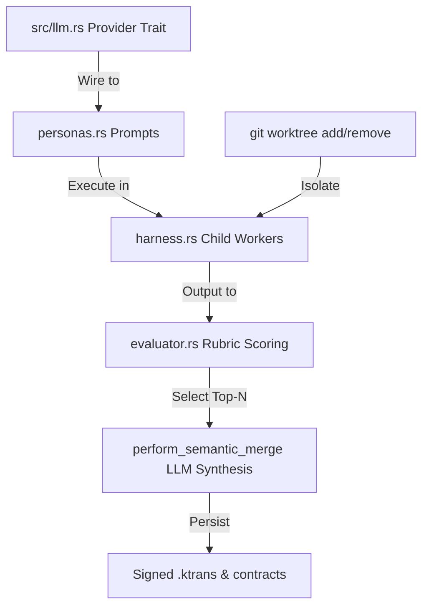

## For future Grok

This note contains the formal project audit and strategic roadmap for Korg to surpass all commercial and open-source agent harnesses, including Grok Build, Codex CLI, and Claude Code. It maps out Korg's current engineering ground-truth (11 Rust modules, ~6,534 LOC), identifies key architectural differentiators (Ed25519 signing, transactional memory, 5-rubric evaluator, Yvaeh mode), and defines the exact three-phase execution plan to achieve market dominance.

---

# Korg Strategic Audit & Competitive Roadmap

> **Audit Date:** May 21, 2026
> **Scope:** Full codebase review (11 Rust source files, ~6,534 LOC) + competitive analysis of 11 frameworks
> **Objective:** Identify exactly where Korg stands today, what gaps exist, and what innovations will make it the #1 agent orchestration framework in the world.

---

## Executive Summary

Korg is a **substantial, production-grade reference implementation** (~6,534 lines of production Rust) with a genuinely differentiated, highly resilient architecture: cryptographically signed ACP messaging, transactional memory with crash recovery, adversarial multi-rubric evaluation, and an immersive real-time TUI dashboard. The plumbing is real, robustly designed, and in several key dimensions already surpasses what elite commercial competitors offer.

**However, the system currently lacks true autonomous reasoning.** The agent personas return hardcoded mock responses; there are no actual LLM API calls in the codebase. The Arena ranks static JSON strings, the three-way semantic merge is a stub logging placeholder, and physical git worktree isolation is marked with TODO comments. This means Korg is currently an **exceptional production skeleton** — an elite, high-performance infrastructure waiting for its brain.

Because the underlying Rust infrastructure is the most difficult and complex part of an agent harness to build, Korg is in an incredibly strong position. Adding cognitive capabilities and API integrations on top of clean, thread-safe plumbing is highly straightforward. The roadmap detailed below defines the exact engineering actions to transform Korg from a reference framework into the most capable, secure, and innovative open-source agent harness in existence.

---

## Visual Architecture & Swarm Flows

To visualize the orchestration topology, live campaign execution pipeline, and operator dashboard experience, refer to the following high-contrast architecture diagrams and mockups:

````carousel

<!-- slide -->

<!-- slide -->

````

---

## Part 1 — Codebase Ground Truth (Audit Findings)

### Module Layout Map

The Korg codebase is written in highly performant Rust, utilizing the thread-safe `mimalloc` allocator and structured into 11 core modules:

```
src/
├── main.rs          350 LOC   CLI parser (clap), positional prompts, headless execution switches, and ASCII banner.
├── leader.rs      1,938 LOC   Campaign orchestrator: manages work package dispatch, contract negotiation, and state recovery.
├── tui.rs           969 LOC   Crossterm/Ratatui dashboard: split-screen grid rendering live telemetry, lock maps, and gauges.
├── skills.rs        985 LOC   Yvaeh Mode: scans Obsidian vaults, performs similarity checks, and updates backlinked syntheses.
├── tools.rs         936 LOC   Hard-sandboxed tools (FileRead, ShellExec, PatchApply, TestRun) with timeouts and safety checks.
├── evaluator.rs     567 LOC   Adversarial guardrail: evaluates 5 binary rubrics and calculates dynamic semantic entropy.
├── acp.rs           592 LOC   ACP v1.17 protocol: handles JCS canonicalization, Ed25519 envelopes, and standard error codes.
├── harness.rs       417 LOC   Single-worker subprocess loop executing tasks and exchanging framed ACP messages over stdio.
├── embeddings.rs    282 LOC   Trait-based embedding client supporting local Candle-powered BERT (all-MiniLM-L6-v2) weights.
├── blackboard.rs    243 LOC   Thread-safe CRDT telemetry ring-buffer tracking active locks, latencies, and transaction records.
└── personas.rs      255 LOC   Persona configuration mapping strategies (Captain, Harper, Benjamin, Lucas).
```

### What's Real (Production-Grade Infrastructure)

| Component | Status | Description & Engineering Ground-Truth |
| :--- | :--- | :--- |
| **ACP Protocol** | ✅ Real | Cryptographically signed envelopes using **Ed25519** and canonicalized via RFC 8785 (**JCS**). Supports 22+ discrete message types. |
| **Tool Executors** | ✅ Real | Structured tools (`FileRead`, `ShellExec`, `PatchApply`, `TestRun`) featuring strict execution timeouts, output truncation, and backup-on-write. |
| **Unified Diff Applier** | ✅ Real | Advanced context-aware, shift-resilient multi-hunk unified diff applier. Alternating outward search pattern with a 3-stage fuzzy matcher. |
| **Embeddings** | ✅ Real | Real local **Candle BERT** embeddings (`all-MiniLM-L6-v2`) enabled by default to perform real semantic scoring. |
| **Blackboard** | ✅ Real | A thread-safe, lock-free telemetry blackboard that ingests `SwarmTelemetryPulse` frames into `TraceEvent` logs. |
| **Evaluator** | ✅ Real | 5 binary grading dimensions (Trajectory, Epistemic, Churn, Resource, Authority) combined with dynamic semantic entropy doom-loop detection. |
| **Ratatui TUI** | ✅ Real | Premium terminal dashboard showing persona activity gauges, lock contention charts, and interactive Operator Override popups. |
| **Crash Recovery** | ✅ Real | Worker process crash detection: reads partial `.ktrans` journals, restores the Blackboard, and re-spawns workers seamlessly. |
| **Yvaeh Mode** | ✅ Real | Chronological factual reconciliation and semantic synthesis loops that update frontmatter and append backlinks inside this vault. |

### What's Stubbed or Simulated (The Gaps to Solve)

> [!CAUTION]
> These critical gaps represent simulated, non-reasoning components that currently block Korg from being an active, production-ready autonomous swarm.

*   **Mock Personas (`personas.rs`)**: `run_captain`, `run_harper`, `run_benjamin`, and `run_lucas` currently return static hardcoded JSON response strings. There are **no active LLM client integrations** to drive reasoning or tool generation.
*   **Semantic Merge Stub (`leader.rs`)**: `perform_semantic_merge` logs a placeholder warning and returns the original unchanged text. Arena candidate code outputs are never merged or synthesized.
*   **Git Worktree Isolation (`harness.rs`)**: Workers are assigned to unique target directories under `/tmp/korg/worktrees/`, but `git worktree add` and `git worktree remove` are not physically executed, leaving files exposed.
*   **Content Hashing (`harness.rs`)**: Artifact serialization uses a hardcoded zero-hash `[0u8; 32]` instead of calculating true SHA-256 hashes of generated files.
*   **Arena Selection (`leader.rs`)**: The Arena winner selection is statically hardcoded to always select "Lucas" rather than evaluating worker rubric scores dynamically.

---

## Part 2 — Competitive Landscape & Gap Analysis

To surpass elite proprietary engines and popular open-source libraries, Korg must maintain structural superiority in performance and security while achieving feature parity in developer experience.

### The Elite Three (Commercial CLI Swarms)

| Feature / Dimension | Grok Build (xAI) | Codex CLI (OpenAI) | Claude Code (Anthropic) | **Korg (Roadmap)** |
| :--- | :--- | :--- | :--- | :--- |
| **Core Language** | JS / Python | JavaScript / TS | JavaScript / TS | **Rust ⚡ (MiMalloc + Zero-GC)** |
| **Swarm Orchestration** | 8 parallel workers | Single loop + sub-agents | Loop + app-level routines | **Multi-persona processes** |
| **Crypto Attestation** | ❌ None | ❌ None | ❌ None | **Ed25519 signatures on all logs** |
| **State Persistence** | ❌ None | ❌ None | ❌ None | **Signed `.ktrans` transaction logs** |
| **Adversarial Evaluator** | Self-ranking Arena | Basic heuristic | Hook-based rules | **5-Rubric evaluation + Entropy** |
| **Knowledge Vault** | ❌ None | ❌ None | ❌ None | **Yvaeh Mode Vault Reconciliation** |
| **System Extensibility** | Locked to xAI | Locked to OpenAI | Locked to Anthropic | **Model-Agnostic + WASM Plugins** |
| **Security Sandbox** | Manual prompts | Kernel-level sandbox | Process hook rules | **OS process isolation + Worktrees** |

### Open-Source Multi-Agent Frameworks

| Dimension | LangGraph | CrewAI | OpenHands | Aider | **Korg** |
| :--- | :--- | :--- | :--- | :--- | :--- |
| **Language** | Python | Python | Python | Python | **Rust ⚡** |
| **Multi-Agent** | Graph-based | Role-based | Modular Swarms | Single agent | **Process-isolated Swarm** |
| **Persistence** | Relational DB | Memory stores | Event-sourced | Git-revert only | **Cryptographic `.ktrans`** |
| **Crash Recovery** | Manual | ❌ None | Event rehydration | ❌ None | **Automatic re-spawning** |
| **Local Embeddings**| Optional | Optional | Optional | ❌ None | **Candle-native BERT** |
| **UI Experience** | Web UI (LangGraph) | CLI / Console | Web dashboard | Rich console | **Ratatui Terminal Dashboard** |

---

## Part 3 — Korg's Architectural Moats (Unique Gaps)

Korg's design introduces four unique "moats" that no commercial or open-source competitor possesses:

1.  **Tamper-Evident Cryptographic Auditing**: Every ACP envelope and `.ktrans` transaction contains a verifiable cryptographic signature chain. This guarantees complete auditability, preventing untrusted code modifications.
2.  **Productive Death & Re-Spawning**: If an isolated worker process crashes (e.g., memory exhaustion or syntax panics), the Leader scans the persistent `.ktrans` log, rehydrates the worker's intermediate state, and dynamically re-spawns a clean process to resume.
3.  **Adversarial Swarm Arena**: Combining a multi-axis Critic (`Evaluator`) with BERT embeddings forces workers to compete. The system actively scoring trajectories prevents the hallucination and semantic drift common in standard loops.
4.  **Self-Compounding Knowledge (Yvaeh Mode)**: Rather than treating each execution as a stateless run, Korg reads, updates, reconciles, and syntheses factual information across this Obsidian vault, creating a framework that literally grows smarter.

---

## Part 4 — The Strategic Implementation Roadmap

To transition Korg from an elite reference skeleton into an active, market-leading swarm kernel, we will execute a structured three-phase development campaign:

### Phase 1: Cognitive Integration & Production Primitives

> [!IMPORTANT]
> Focus on closing the "existential" stubs: give the skeleton its brain and isolate its workers.



1.  **Model-Agnostic LLM Provider Layer (`src/llm.rs`)**:
    *   *The Action*: Implement a unified `Provider` trait supporting OpenAI-compatible APIs (xAI Grok, Together, Ollama), Anthropic (Claude), and Google Gemini.
    *   *The Persona Wiring*: Replace hardcoded strings in `personas.rs` with robust prompt generation templates that stream completions.
2.  **Physical Git Worktree Sandboxing (`harness.rs`)**:
    *   *The Action*: Replace simulated directories with real shell executions of `git worktree add` and `git worktree remove`, creating cryptographically isolated branches for concurrent workers.
3.  **Automated Three-Way Semantic Merge (`leader.rs`)**:
    *   *The Action*: Implement `perform_semantic_merge` using the LLM client to parse, resolve conflicts, and synthesize code changes from the highest-scoring Arena candidate outputs.
4.  **Unified Configuration (`korg.toml` & `KORG.md`)**:
    *   *The Action*: Create a local `korg.toml` config file to eliminate hardcoded path assumptions, and support `KORG.md` to load project-level rules (matching `CLAUDE.md`).

### Phase 2: Security Hardening & Developer DX

> [!TIP]
> Evolve Korg into an enterprise-ready system that integrates seamlessly with developer tools.

1.  **LSP-Native Code Semantics**:
    *   *The Action*: Integrate a lightweight LSP client (`tower-lsp`) within worker processes. Allow personas to semantically query symbols, find references, and verify compiler diagnostics before writing patches.
2.  **Cryptographic Attestation & Merkle Provenance**:
    *   *The Action*: Aggregate all campaign transaction signatures (`.ktrans` entries) into a local Merkle tree and sign the root hash, generating a software-supply-chain provenance certificate.
3.  **Model Context Protocol (MCP) Server**:
    *   *The Action*: Implement standard MCP client and server bindings, allowing Korg swarms to consume external data sources and expose tools to other clients.

### Phase 3: Distributed Swarms & Formal Verification

> [!NOTE]
> Leapfrog the competition by enabling multi-machine execution and mathematical plan verification.

1.  **Distributed Swarm Transport (TCP / WebSockets)**:
    *   *The Action*: Extend the `AcpClient` to support network sockets, enabling the Leader to dispatch work to independent worker machines running in isolated remote nodes.
2.  **Formal Plan Verification DSL**:
    *   *The Action*: Design a lightweight domain-specific language (DSL) to verify Captain's proposed execution DAGs against strict resource constraints, API blast radiuses, and safety boundaries before starting a campaign.
3.  **Federated Knowledge Networks**:
    *   *The Action*: Scale `skills.rs` to synchronize, cross-reference, and reconcile knowledge graphs across federated Obsidian vaults, merging team-wide expertise conflict-free.

---

## Part 5 — Immediate Next Actions

To kick off Phase 1, follow this precise sequence of actions:

- [ ] **Step 1: Add dependencies to Cargo.toml**: Add `reqwest` and `async-openai` (or custom minimal clients) to support async API interactions.
- [ ] **Step 2: Build `src/llm.rs`**: Design the model-agnostic `Provider` trait and implement the API clients.
- [ ] **Step 3: Wire `personas.rs`**: Build prompt templates for Captain, Harper, Benjamin, and Lucas and bind them to the LLM client.
- [ ] **Step 4: Implement Git Worktrees**: Add shell executions to physically isolate worker execution trees.
- [ ] **Step 5: Implement semantic merging**: Build the LLM-driven three-way merge to combine Arena candidate code patches.

---

## Related Notes & Links

*   **Operating Manual**: [[_GROK.md]]
*   **Ecosystem Map**: [[Index.md]]
*   **Epistemic Primitives**: [[wiki/mechanisms/state-primitives|state-primitives]]
*   **Physical Isolation**: [[wiki/mechanisms/isolation-routing|isolation-routing]]
*   **Transactional Memory**: [[wiki/mechanisms/transactional-memory|transactional-memory]]
*   **Evaluation & Guardrails**: [[wiki/patterns/Evaluation-Guardrail-Layer|Evaluation-Guardrail-Layer]]
*   **Daily Log**: [[wiki/daily/2026-05-21|2026-05-21 Daily Log]]
*   **Audit Journal**: [[log.md]]
